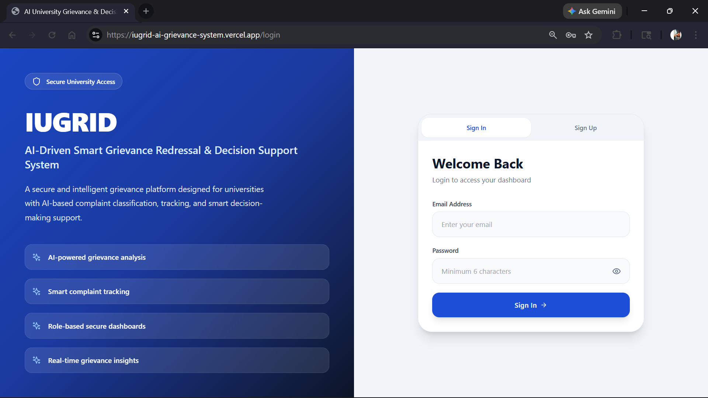
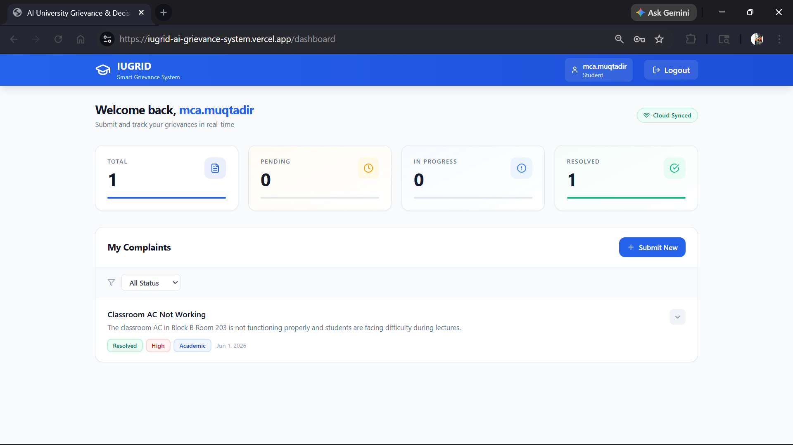
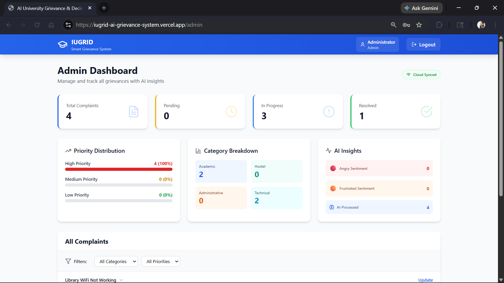
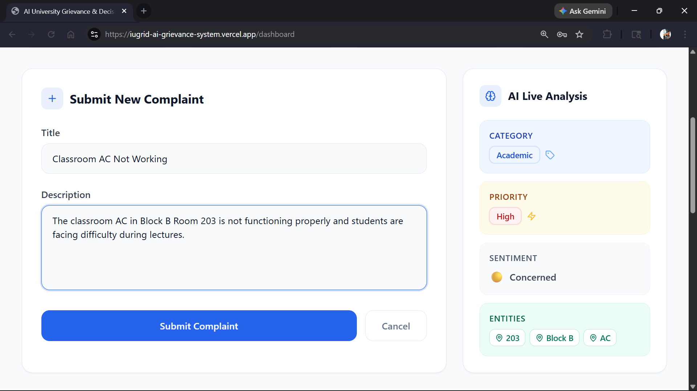
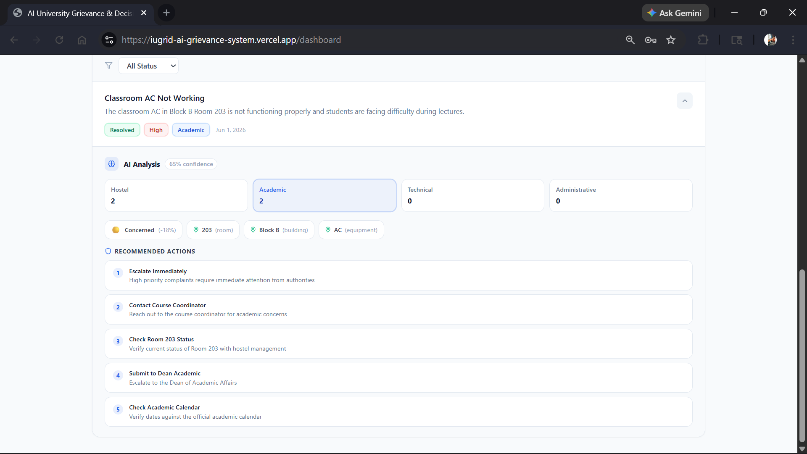

# IUGRID — AI-Driven Smart Grievance Redressal & Decision Support System for Universities

IUGRID is an AI-driven smart grievance redressal and decision support platform designed for universities. The system enables students to submit, track, and manage grievances while helping administrators streamline complaint handling through intelligent complaint categorization, prioritization, sentiment analysis, and decision support.

The platform analyzes complaint text and provides structured insights to assist university authorities in understanding grievances more efficiently and making faster decisions.

---

## Live Demo

**Live Website:**
https://iugrid-ai-grievance-system.vercel.app

---

## Features

### Student Module

- Student registration and authentication
- Secure login system
- Email verification support
- Submit grievances/complaints
- View complaint history
- AI-powered complaint analysis
- Complaint status tracking
- Delete pending complaints before processing

### Admin Module

- Admin authentication
- View all complaints
- Monitor grievance workflow
- Update complaint status
- Complaint categorization and prioritization
- Decision support dashboard

### AI-Based Complaint Analysis

- Complaint category classification
- Priority detection
- Confidence scoring
- Sentiment analysis
- Entity detection
- Suggested actions for administrators
- Structured complaint insights

### Security Features

- Authentication using Supabase Auth
- Email verification
- Role-based access control (Student/Admin)
- Protected routes
- Row Level Security (RLS)

---

## Tech Stack

### Frontend

- React.js
- TypeScript
- Tailwind CSS
- Zustand
- React Hook Form
- Zod Validation
- Lucide React
- React Hot Toast

### Backend & Database

- Supabase
- PostgreSQL
- Supabase Authentication
- Row Level Security (RLS)

### Deployment

- Vercel
- GitHub

---

## Project Workflow

```text
Student Complaint Submission
            ↓
Complaint Analysis
            ↓
Category & Priority Detection
            ↓
Admin Review & Decision Support
            ↓
Complaint Status Management
            ↓
Resolution Tracking
```

## Authentication Flow

```text
Signup
   ↓
Email Verification
   ↓
Login
   ↓
Role-Based Dashboard Access
```

---

## Installation & Setup

### Clone Repository

```bash
git clone https://github.com/muqtadirkhxn/iugrid-ai-grievance-system.git
```

### Navigate to Project Directory

```bash
cd iugrid-ai-grievance-system
```

### Install Dependencies

```bash
npm install
```

### Configure Environment Variables

Create a `.env` file in the root directory:

```env
VITE_SUPABASE_URL=your_supabase_url
VITE_SUPABASE_ANON_KEY=your_supabase_anon_key
```

### Run Development Server

```bash
npm run dev
```

### Build Project

```bash
npm run build
```

---

## Folder Structure

```txt
src/
│── components/
│── pages/
│── lib/
│── store/
│── types/
│── App.tsx
│── main.tsx
```

---

## Screenshots

### Login Page



### Student Dashboard



### Admin Dashboard



### Complaint Submission



### AI Complaint Analysis



---

## Future Improvements

- File attachment support for complaints
- Complaint analytics dashboard
- Real-time notifications
- Improved complaint insights
- Enhanced admin reporting system

---

## Author

**Muqtadir Khan**

GitHub: https://github.com/muqtadirkhxn

LinkedIn: https://www.linkedin.com/in/muqtadirkhxn/

---

## License

This project is developed for academic, portfolio, and learning purposes.
